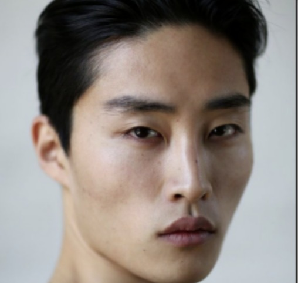
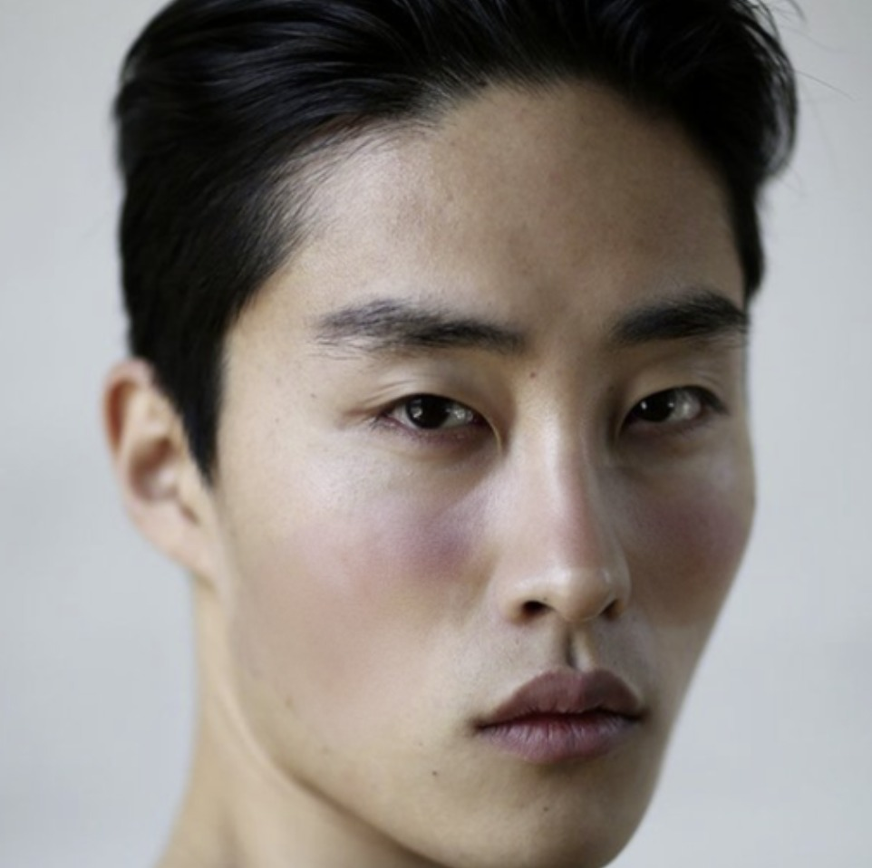
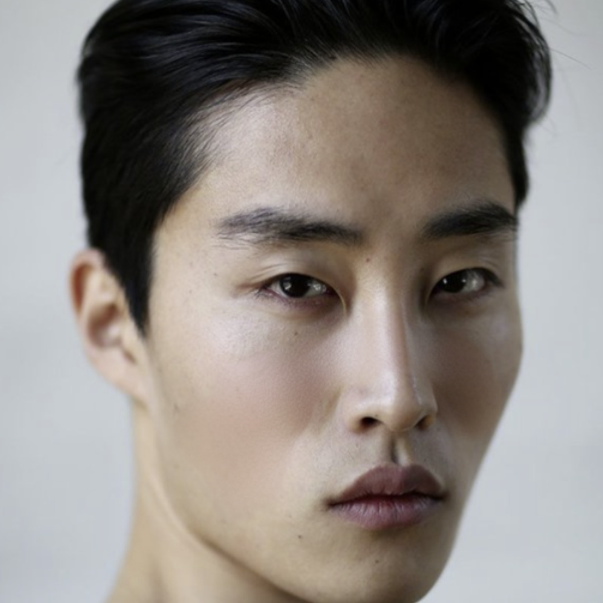

  

# Visually Explaining Progression of Skin Conditions

Inpainting with Stable Diffusion fine-tuned on common and rare skin conditions.

<<<<<<< HEAD

  
  
  
  

  
  
  

## Web UI

Our WebUI is an adapted version of the one present in https://github.com/AUTOMATIC1111/stable-diffusion-webui. To install and run our code, follow the following steps:

1) Follow the steps in https://github.com/AUTOMATIC1111/stable-diffusion-webui
2) Copy the folder `embeddings` to `stable-diffusion-webui`
3) Run `webui.sh`
4) Add the script `tampermonkey_js` to your browser of choice, and click on the button `Replace Textarea Content`
5) Generate new images!

## Finetuning details

We fine-tune new embeddings through textual inversion:

1. We follow the textual inversion technique explained here: https://github.com/AUTOMATIC1111/stable-diffusion-webui/wiki/Textual-Inversion
2. The embeddings have 2 tokens.
3. Set the learning rate for the embeddings to 0.005.
4. The batch size is 2.
5. Use the prompt template provided in prompt_template.txt file.
6. The training process involves 500-4000 steps.

