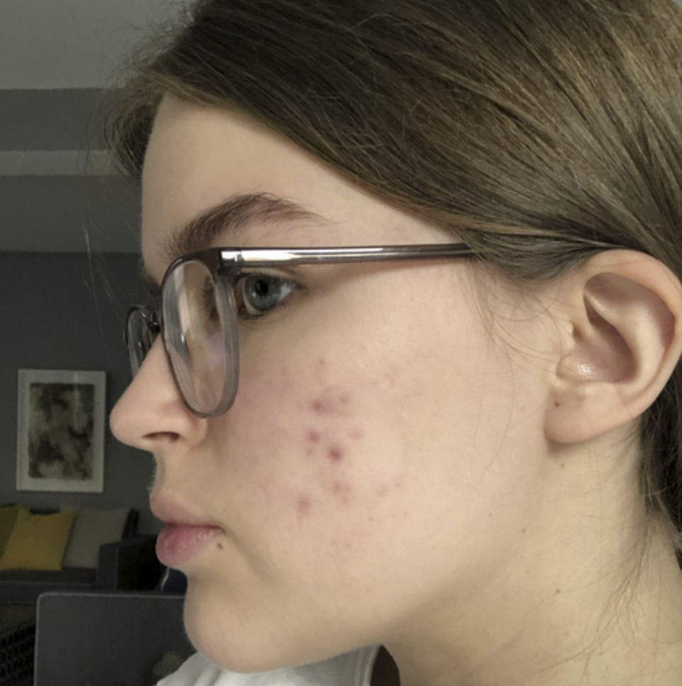
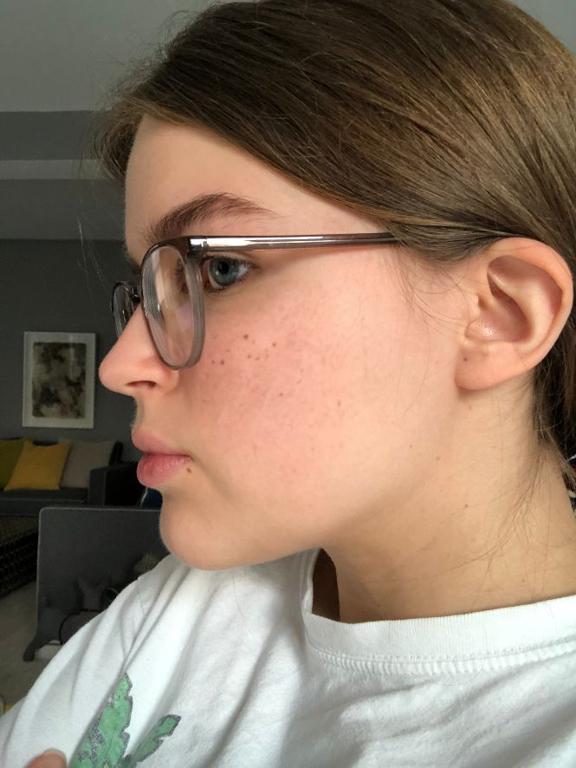

# Name of Project

Inpainting with Stable Diffusion fine-tuned on common and rare skin conditions.

 |  |   | 
:-------------------------:|:-------------------------:|:-------------------------:|:-------------------------:
 Acne early stage     |  Actual acne growth      |  Acne growth prediction by our model      |  Acne growth prediction by StableDiffusion

## Web UI

Our WebUI is an adapted version of the one present in https://github.com/AUTOMATIC1111/stable-diffusion-webui. To install and run our code, follow the following steps:

1) Follow the steps in https://github.com/AUTOMATIC1111/stable-diffusion-webui
2) Copy the folder `embeddings` to `stable-diffusion-webui`
3) Run `webui.sh`
4) Add the script `tampermonkey_js` to your browser of choice, and click on the button `Replace Textarea Content`
5) Generate new images!

