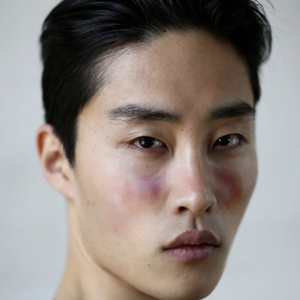
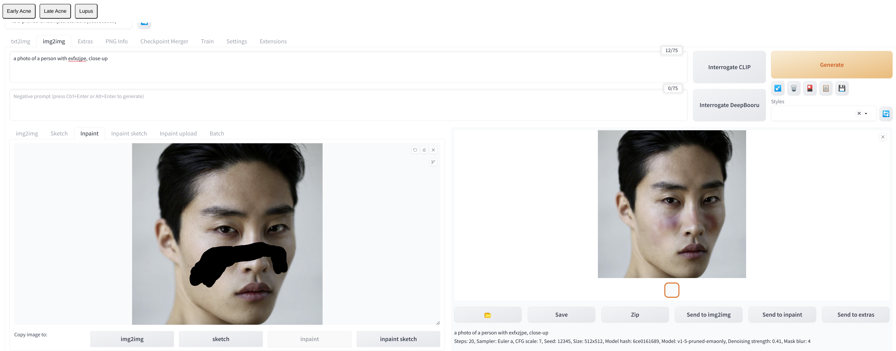

  

# TrueSkin: Accurately Visualizing Skin Conditions

Inpainting with Stable Diffusion fine-tuned on common and rare skin conditions.

 |  |   | 
:-------------------------:|:-------------------------:|:-------------------------:|:-------------------------:
 Acne late stage     |  Actual acne early stage      |  Acne early stage prediction by our model      |  Acne early stage prediction by StableDiffusion

 |   |  | 
:-------------------------:|:-------------------------|:-------------------------:|:-------------------------:
 Base Image    | Actual Lupus Butterfly rash |  Lupus Butterfly rash predicted by our Model     |  Lupus Butterfly rash predicted by Stable Diffusion

## Implementation

## Dataset

We manually collect data samples of the skin diseases  Acne at different stages and Lupus. They are saved in `Acne_progression` and `Lupus`, respectively.

### Finetuning

We want to accurately visualize skin conditions on people's faces.

To this end, we apply [textual inversion](https://arxiv.org/abs/2208.01618) with Stable Diffusion
to finetune new text embeddings for skin conditions such as acne or Lupus.

We deploy https://github.com/AUTOMATIC1111/stable-diffusion-webui for the finetuning.

A detailed overview of textual inversion in `stable-diffusion-webui` is given here:
https://github.com/AUTOMATIC1111/stable-diffusion-webui/wiki/Textual-Inversion.

Our model uses the following hyperparamters:
* Embedding length: 2 tokens.
* Embedding learning rate: 0.005.
* Batch size: 2.
* Prompt template: See prompt_template.txt.
* Train for 500 - 4000 steps, stop when samples of sufficient quality are produced.

### Web UI

Our WebUI is an adapted version of the one present in https://github.com/AUTOMATIC1111/stable-diffusion-webui. To install and run our code, follow the following steps:

1) Follow the steps in https://github.com/AUTOMATIC1111/stable-diffusion-webui
2) Copy the folder `embeddings` to `stable-diffusion-webui`
3) Run `webui.sh`
4) Add the script `tampermonkey_js` to your browser of choice, and click on the button `Replace Textarea Content`
5) Generate new images!

  

